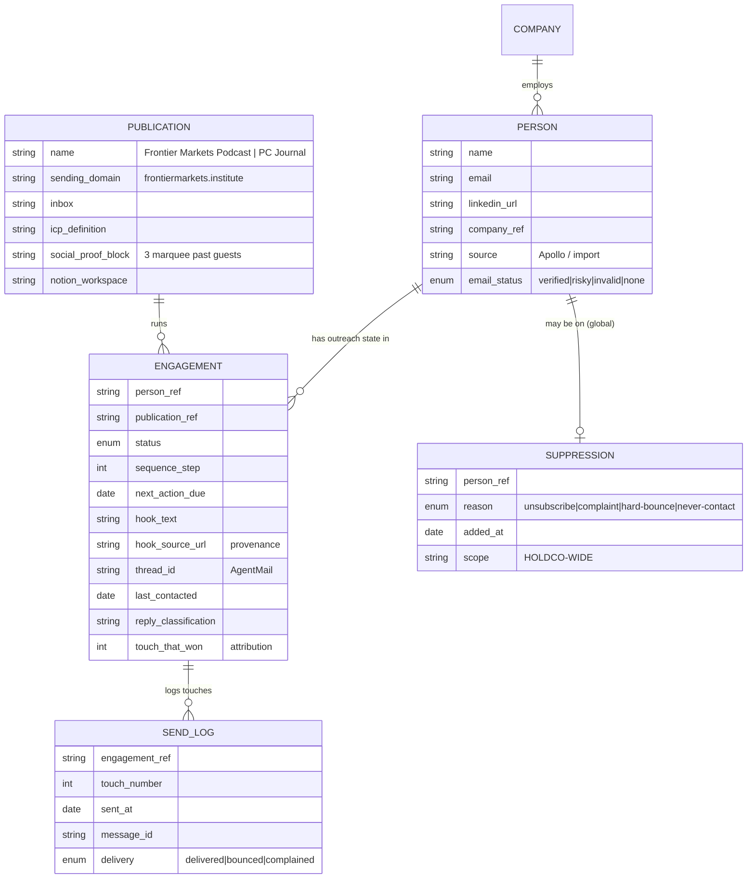
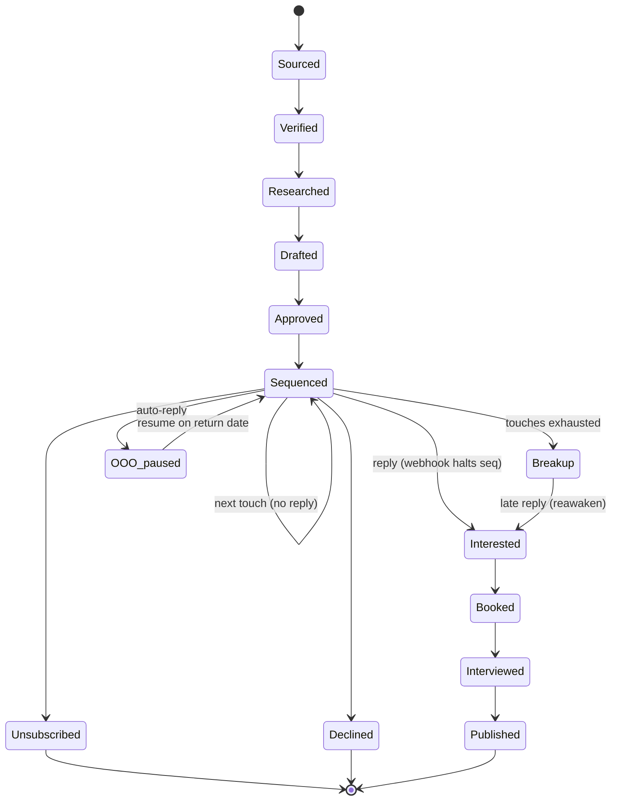

# ✨ Agent-Driven Interview-Outreach System — Architecture Plan

> **Status:** Design / architecture proposal · **Date:** 2026-06-04 · **Owner:** Krish
> **One-line:** A pipeline of stage-owned agents that source interview prospects, personalize an invite, send + follow up, triage replies, and book guests — with Attio as the brain — to land **3–5 yeses per cycle**.

---

## 1. Executive Summary

Playing Field Group owns interview-based publications (Frontier Markets Podcast, a Private Credit Journal, more to come). The lifeblood is **booking guests**. Today that's manual. The goal is a system where **agents own each stage of a guest-acquisition funnel** and a human supervises by exception.

This is, structurally, **a sales pipeline where "closed-won" is a booked interview.** Treat it like one: a clear funnel, a CRM as the single source of truth, stage-owned agents handing off through it, and a few non-negotiable safety gates.

**The thesis of this plan, in five decisions:**

1. **Model pipeline state per `(Person × Publication)` engagement, not per person.** A holdco with several publications needs one shared, deduped contact universe but *independent outreach state* per publication. This is the keystone schema decision; everything else hangs off it.
2. **Attio is the single source of truth.** Agents are stateless and restartable; all pipeline state, suppression, and audit live in Attio.
3. **Stage-owned agents, not a monolith:** Sourcer → Researcher → Writer → Sender → Follow-up → Reply-Triage, plus a Booker. Each owns one status transition.
4. **Hybrid execution:** cron for outbound (sourcing, drafting, follow-ups, under a daily cap), **webhooks for inbound** (a reply *must* halt the sequence the moment it lands — the cardinal anti-bot rule).
5. **Crawl → Walk → Run on human-in-the-loop.** Cycle 1 is human-approves-everything. Autonomy expands only as measured quality clears a bar. Three gates *never* graduate: suppression check, daily cap, deliverability auto-pause.

**What already exists (don't rebuild):** the proven sending identity `krish@frontiermarkets.institute`, a battle-tested 5-beat plain-text template (§9), and a populated-but-dirty Attio contact universe.

**What's greenfield:** the entire pipeline layer — Attio Lists/stages, the engagement object, outreach-status attributes, the suppression gate, and the Apollo↔Attio↔AgentMail wiring.

---

## 2. The Funnel Math (why ~50/day is right)

The target — 3–5 yeses per cycle — sets the volume. Using benchmarks for well-targeted, credible, plain-text, signal-personalized editorial outreach (an interview ask converts *better* than a sales demo: it's flattering, free, and has no budget friction):

**Central case** — 12% reply rate · 50% of replies positive · 65% positive→yes ≈ **3.9% sent→yes**

```
3 yeses ÷ 0.039 ≈  77 contacts
5 yeses ÷ 0.039 ≈ 128 contacts
```

| Scenario | Reply | Positive | →Yes | Sent→Yes | Contacts for 3–5 yeses |
|---|---|---|---|---|---|
| Pessimistic | 8% | 40% | 50% | 1.6% | ~190–310 |
| **Central** | **12%** | **50%** | **65%** | **3.9%** | **~77–128** |
| Best-in-class | 18% | 60% | 70% | 7.6% | ~40–66 |

**Conclusion:** a cycle needs **~130–190 fresh contacts** in the central case. At **40–50 fresh contacts/day over a 3–4 day sending window** (then a ~3-week sequence tail), that lands squarely in range. **Critically: stop sourcing once 3 yeses are in hand** — don't mechanically send 200 when the cycle is hitting best-in-class rates.

> So "50 emails/day" is right as a **cap on fresh contacts during a multi-day sending window**, not a daily quota to grind forever.

---

## 3. Core Architectural Decisions

### Decision 1 — Unit of state: `(Person × Publication)` engagement ⭐ keystone

A single executive can be an ideal guest for *both* the Frontier Markets Podcast *and* the Private Credit Journal. A per-person status field cannot represent "Interested for A, never-sourced for B." Therefore:

- **Person** and **Company** stay shared and deduped (one record per human across the holdco).
- **Outreach state lives on an `Engagement` record** — one per `(Person × Publication)` — carrying status, sequence step, hook, send log, and reply state.
- **Suppression is global** (holdco-wide, see Decision 5); **eligibility/ICP is per-publication.**

This repurposes Attio's currently-empty **Deals** object (or a new custom object) as `Engagement`. It's the difference between a system that works for one publication and one that works for the holdco.

### Decision 2 — Sending identity: one domain per publication (you've already chosen this)

`krish@frontiermarkets.institute` is *already* a per-publication cousin domain, not `playingfield.co`. That instinct was correct and is the recommended pattern:

- Each publication sends from **its own domain + inbox**, carrying that publication's brand as the credibility hook.
- Reputation is **firewalled per publication** — one publication's bad batch can't sink another, and can't touch the corporate `playingfield.co` domain.
- The cost: each new publication's domain needs its **own SPF/DKIM/DMARC + a 3-week warmup** before hitting 40–50/day (§10).

Credibility comes from the **sender persona + signature + real masthead bio**, not the TLD — so a `.institute`/`.co`/`.media` cousin domain reads as legitimately yours while protecting the brand.

### Decision 3 — Attio is the single source of truth

State lives in the CRM, never in agent memory or the email tool. Benefits: agents are stateless/restartable, you get a GDPR-grade audit trail, and the suppression + daily-cap gates live where *every* agent checks them. AgentMail holds threads; Apollo is discovery-only; Notion is editorial-only. None of them hold pipeline state.

### Decision 4 — Hybrid execution: cron out, webhook in

- **Cron (business hours):** Sourcer, Researcher, Writer, Sender (first touches), Follow-up. These enforce the daily cap, spread/throttle sends, and check health thresholds before sending.
- **Webhook (event-driven):** AgentMail `message.received` → **Reply-Triage fires immediately** → flips the Engagement to `Replied` and cancels scheduled follow-ups. A cron-only design risks sending a follow-up *after* someone replied — the #1 bot tell. A reconciling poll backstops missed/duplicate webhooks (§7).

### Decision 5 — Human-in-the-loop, graduating to autonomy

Outbound email is a consequential, brand-facing action → approval checkpoint early, loosened as data accrues (§12). **Three gates never graduate to autonomous:** the suppression/never-contact check, the daily cap, and the deliverability auto-pause. Those stay as hard code, forever.

---

## 4. The Agents (stage-owned)

Each agent owns exactly one status transition, reads/writes Attio, and is independently debuggable and graduate-able.

| Agent | Trigger | Owns transition | Tools | Key guardrail |
|---|---|---|---|---|
| **Sourcer** | Cron (cycle start) | `—` → `Sourced` | Apollo `people_search`/`org_search` (free), dedupe vs Attio | ICP filter; per-company cap; suppression pre-check |
| **Verifier** | Cron | `Sourced` → `Verified`/`Risky`/`Invalid` | Apollo `get_person_email` (1 cr) + email-verification pass | <4% bounce ceiling — hold `Risky` |
| **Researcher** | Cron | `Verified` → `Researched` | Exa / Firecrawl web research | One *true, recent, cited* hook; do-not-reference rule |
| **Writer** | Cron | `Researched` → `Drafted` | LLM + the §9 template | Voice check; ≤120 words; plain text |
| **Approver** | Human (early cycles) | `Drafted` → `Approved`/`Rejected` | Review queue | SLA on stale drafts |
| **Sender** | Cron (send window) | `Approved` → `Sequenced(1)` | AgentMail `send_message` | Daily cap; suppression gate; send-idempotency |
| **Follow-up** | Cron (daily) | `Sequenced(n)` → `Sequenced(n+1)` / `Breakup` | AgentMail; Attio "who's due" query | **Atomic reply-check at send time** |
| **Reply-Triage** | **Webhook** `message.received` | `Sequenced(*)` → `Interested`/`Declined`/`OOO`/… | AgentMail thread match | Confidence threshold → human fallback |
| **Booker** | On `Interested` | `Interested` → `Booked` | Google Calendar / Calendly | Stalled-yes + ghosted-booking nudges |
| **Editor handoff** | On `Interested` | side-effect | Notion page create + notify | Idempotent (no half-handoffs) |

> **Daily flow:** Attio query (due + uncontacted, under cap) → personalize → AgentMail send → write `last_contacted` + `thread_id` to Attio. Reply webhook → Attio `Replied`, halt. `Interested` → Notion prep page + booking link. `Booked` → calendar event + Attio `Booked`.

---

## 5. State Model

### 5.1 Statuses (on the `Engagement` record)

```
Sourced → Verified ┬→ Researched → Drafted → Approved → Sequenced(1..4) → Breakup
                   └→ Risky/Invalid/No-email (held / disqualified)

Reply substates (terminal-ish):  Interested · Nurture(soft-maybe) · Not-now ·
                                 Declined · OOO-paused · Wrong-person/Referred ·
                                 Bounced · Complaint · Unsubscribed

Post-yes:  Interested → Handed-to-editor → Booking-sent → Booked →
           (No-show | Interviewed → Published)

Holding/terminal:  Stalled-yes · Ghosted-booking · Suppressed · Disqualified
```

**Design rules the implementation must honor:**
- **`status`, `sequence_step`, and `next_action_due` are separate fields.** Follow-up reads `next_action_due` + an *atomic* reply check; it never infers "should I send?" from status alone.
- **Legal transitions are explicit.** `Unsubscribed` and `Complaint` are **hard-terminal — no transition out, ever.** A late reply *can* reawaken `Breakup`/`Declined`/`Not-now` → `Interested` (the "months-later yes").
- **One agent owns each transition** (table §4) → no conflicting writes. Attio's 25 writes/s ceiling is irrelevant at this volume; the real risk is two agents racing the same record, prevented by single-owner transitions + idempotency keys.

### 5.2 Data model (ERD)



### 5.3 State machine (the happy path + the dangerous edges)



---

## 6. Daily Orchestration Flow

1. **Cron tick (morning):** Sourcer tops up the cycle to ~50 fresh contacts *if* fewer than 3 yeses banked.
2. Verifier → Researcher → Writer process the new batch into `Drafted`.
3. **Approval gate:** human (early) or auto (later) → `Approved`.
4. **Sender** drains the `Approved` queue **within the send window**, spread + jittered, **checking the daily cap and suppression on every send.**
5. **Follow-up** queries Attio: `status=Sequenced AND next_action_due ≤ today AND no reply` → sends the next touch (or breakup), re-checking reply state **atomically at send**.
6. **Any inbound** → webhook → Reply-Triage classifies, halts sequence, routes.
7. **Interested** → Notion prep page + booking link + notify editor.
8. **Monitoring** job watches bounce/complaint/cap/queue-depth and pages a human on threshold breach.

---

## 7. Hard Guardrails (never graduate to autonomous)

- **Suppression gate** — every send, across all inboxes, checks the global `Suppression` list *first*. Unsubscribe/complaint/hard-bounce auto-add here, holdco-wide, instantly.
- **Daily cap** — transactional/locked counter per inbox so two Sender invocations can't overshoot 50.
- **Deliverability auto-pause** — pause the inbox if **spam complaints > 0.1%** or **bounce > 2%** (AgentMail hard-blocks an account at 4% and permanently blocks a bounced address — so verify *before* send and circuit-break *per batch*).
- **Send-idempotency** — store `message_id` before/after send; on crash-restart, reconcile against AgentMail's `sent` log before re-sending. Never double-send.
- **Webhook idempotency** — dedupe on `message_id`; a nightly reconciling poll of threads backstops missed events.

---

## 8. Edge-Case Handling (the ones that bite)

| Edge case | Rule |
|---|---|
| **Reply arrives mid-sequence** | Reply-check is **atomic at the moment of each send**, not just at schedule time. Highest-frequency correctness bug. |
| **OOO auto-reply** | Detect; do *not* mark Interested, do *not* halt permanently. Parse return date → resume. |
| **"Talk to my colleague" forward** | Capture referred name → create new Person with `referred_by` link → suppress original. Don't auto-blast the colleague with the cold cadence; route to human/Researcher. |
| **Late reply after breakup** | Reawaken `Breakup`→`Interested`. |
| **Krish replies manually from inbox** | Detect human takeover on the thread → stop automated follow-ups. |
| **Duplicate / dirty prospect** | Dedupe on email → fallback fuzzy name+company+LinkedIn (emails often empty in the dirty import). Near-match → flag for human, don't silent-merge. |
| **Multiple prospects, same firm** | Per-company contact cap per cycle; best-fit first, hold the rest. |
| **Yes-then-ghosts-booking** | `Stalled-yes` → N reminders over a window → `Ghosted-booking` (re-engage next cycle). Booker owns the nudge. |
| **No social-proof for a brand-new publication** | Fallback: borrow "from our sister publication, the Frontier Markets Podcast…" (a brand decision — confirm per publication). |
| **Ambiguous reply ("maybe later")** | Confidence threshold; low-confidence → human fallback. Misclassifying a yes loses a guest; misclassifying a decline as yes embarrasses the brand. |
| **Apollo credits/rate exhausted mid-run** | Partial cycle, resume next cron tick; never fail the whole batch. |

---

## 9. The Voice Artifact (codify the proven template)

The single most valuable asset already exists — the battle-tested Frontier Markets template. Codify it verbatim as the Writer's system prompt. **5-beat skeleton, ~100 words, plain text, signed "Krish"** ([copy-voice-preferences](../memory/copy-voice-preferences.md): plain, not casual, not pompous):

```
Subject: {specific lowercase hook} — podcast invite

Hi {First},                                    ← "Dear Dr {Last}," for senior/govt

{ONE personalized line referencing a specific recent thing they did + light flattery}

I host the {Publication}, where we interview leaders across {beat}.

I'm reaching out because I'd love to have you as a guest on the upcoming
season to discuss {topic tailored to them}.

Past guests have included {3 marquee names, each w/ one-clause credential}, and more.

Would you be open to this? I'm happy to send more info if you'd like!

Best wishes,
Krish
```

**Only beat #2 (hook) and the topic clause in beat #4 vary per recipient** — the natural merge structure for the Researcher→Writer handoff. The ask is a **low-commitment yes/no, not a calendar link**; booking is deferred to the reply. Follow-ups and the breakup inherit this voice (short, warm, never pushy).

---

## 10. Deliverability Setup (per publication domain)

- **Auth:** SPF + DKIM, then **DMARC `p=none` → `quarantine`** (never start at `reject`). RFC 8058 one-click unsubscribe header.
- **Warmup:** new domain → automated warmup tool + real sends for **3 weeks**, ramping 10–20 → 20–40 → **40–50/day cap**. `frontiermarkets.institute` is already warm.
- **Send hygiene:** plain text, **no tracking pixel**, ≤1 link (in signature), spread across business hours with jitter. Plain text ≈ 2× the reply rate and ~87% fewer bounces vs HTML.
- **Verify before send** (Apollo accuracy is imperfect; the 4% bounce ceiling is unforgiving). Role inboxes (`info@`, `press@`) and `.gov`-type addresses bounce more — flag and de-prioritize (the real Frontier Markets campaign saw bounces exactly here).

---

## 11. Compliance

- **CAN-SPAM (US):** valid physical postal address in every email (signature); honor opt-out ≤10 business days (automate to instant).
- **GDPR + PECR (UK/EU, and "frontier markets" = global):** PECR Reg. 22 corporate-subscriber exemption covers job-relevant B2B invites; document **one reusable Legitimate Interests Assessment**; link a privacy notice in touch 1; **exclude sole traders by default** (they need consent). Apollo data is *discovery, not consent* — your basis is your own legitimate interest.
- **Suppression as a first-class object** (§5.2): unsubscribe/complaint/hard-bounce → holdco-wide, hard-terminal, logged with timestamp.
- **Per-contact audit log:** every send, bounce, opt-out, hook + provenance URL, which agent acted, draft version sent.

---

## 12. Roadmap — Crawl / Walk / Run

Don't build the autonomous swarm on day one. You don't yet know your real conversion rates or have multi-publication reputation. Prove the funnel on real data first.

### Phase 1 — CRAWL (Cycles 1–2): prove the funnel, human-in-every-loop
**Goal:** validate voice, hook quality, and real conversion rates on `frontiermarkets.institute` (already warm).
- Build the Attio layer: `Engagement` object, statuses, `Suppression` list, custom attributes.
- Sourcer + Verifier + Researcher + Writer run; **human approves every first-touch draft** (~20–30 min/day for 50 short drafts) and reviews every reply classification.
- Sender + Follow-up automated under the cap; Reply-Triage suggests, human confirms.
- **Exit criteria:** measured reply/positive/yes rates; <2% substantive human edits to drafts; zero suppression misses.

### Phase 2 — WALK: semi-autonomous
- Auto-send follow-ups + breakups (formulaic, low-risk). Auto-send first touches for **high-confidence ICP segments only**, sample-audit 10–20%.
- Auto-halt on reply without approval; human reviews only `Interested` routing + ambiguous replies.
- Stand up the **second publication** (new domain, warmup, its own ICP + social-proof block) — first real test of the multi-publication model.

### Phase 3 — RUN: autonomous with guardrails
- Full loop runs; human handles only `Interested` replies, bookings, and exceptions.
- Booker automates scheduling; Editor-handoff automates Notion prep pages.
- **Graduation is evidence-based:** advance a stage only when its agent clears a bar (e.g. Reply-Triage ≥95% classification accuracy on reviewed samples, zero compliance misses over a cycle). The three hard gates (§7) never graduate.

---

## 13. Measurement

Per publication, per cycle, queryable from Attio for an operator dashboard:
- **Funnel:** sourced → verified → sent → replied → positive → yes → booked → interviewed → published.
- **Rates:** reply %, positive-reply %, sent→yes %, bounce %, complaint %.
- **Attribution:** which touch earned the yes (`touch_that_won`).
- **Quality (for graduation):** draft edit-rate, classification accuracy, time-in-stage.
- **Health:** rolling bounce/complaint vs thresholds; daily-cap consumption.

The cycle self-calibrates: feed real rates back into §2's math so "how many to source" tightens each cycle.

---

## 14. Open Decisions for the Operator

These are genuinely yours; the plan recommends a default but flags the fork:

1. **Engagement object — repurpose empty Deals, or new custom object?** *(Rec: new custom `Engagement` object — Deals carries sales semantics you don't want.)*
2. **Booking tool — Google Calendar (agent reads free/busy, creates event) vs Calendly link.** *(Rec: Calendly link for Phase 1 simplicity; Google Calendar in Phase 3 for autonomy.)*
3. **Per-company contact cap per cycle.** *(Rec: 1, occasionally 2 with a few days' spacing.)*
4. **New-publication social proof** — borrow sister-publication guests, or hold outreach until first guests land? *(Brand call.)*
5. **Who is the approver in Phase 1** — Krish only, or an editor? And the exact graduation metric per stage.
6. **ICP definition per publication** — concrete title/seniority/firm-type/geography filters. *(Blocks Sourcer; needs writing per publication.)*
7. **"A cycle" operationally** — per-publication batch vs calendar window; how cycles overlap across publications.

---

## 15. References & Research

**Internal:**
- Proven sending identity + verbatim template: `krish@frontiermarkets.institute` (AgentMail, real 2026-03-29 campaign).
- Voice constraint: [`memory/copy-voice-preferences.md`](../memory/copy-voice-preferences.md), [`memory/playing-field-positioning.md`](../memory/playing-field-positioning.md).
- Attio workspace `5ce1f4b4-…` — People+Companies populated (dirty), no Lists/pipeline, Deals empty.

**Tool capabilities:** [AgentMail webhooks/events](https://docs.agentmail.to/events) · [AgentMail custom domain](https://docs.agentmail.to/knowledge-base/custom-domain-setup) · [Apollo People Search](https://docs.apollo.io/reference/people-api-search) · [Apollo Enrichment](https://docs.apollo.io/reference/people-enrichment) · [Attio filtering](https://docs.attio.com/rest-api/guides/filtering-and-sorting) · [Attio webhooks](https://docs.attio.com/rest-api/guides/webhooks) · [Notion data sources 2025-09](https://developers.notion.com/docs/upgrade-faqs-2025-09-03)

**Best practices:** [Instantly deliverability](https://instantly.ai/blog/how-to-achieve-90-cold-email-deliverability-in-2025/) · [topo.io sending limits/warmup](https://www.topo.io/blog/safe-sending-limits-cold-email) · [plain vs HTML](https://puzzleinbox.com/blog/cold-email-html-vs-plain-text/) · [reply benchmarks](https://thedigitalbloom.com/learn/cold-outbound-reply-rate-benchmarks/) · [cadence](https://growthlist.co/cold-email-follow-up-timing/) · [breakup email](https://www.nutshell.com/blog/follow-up-email-sequence-sales) · [FTC CAN-SPAM](https://www.ftc.gov/business-guidance/resources/can-spam-act-compliance-guide-business) · [PECR Reg. 22](https://www.salespeople.co.uk/explained/cold-email-pecr-regulation-22) · [multi-agent SDR](https://www.landbase.com/blog/the-ai-sdr-dream-team-multi-agent-systems)

**Stack gaps to resolve:** booking/calendar step (Google Calendar/Calendly), web-research personalization (Exa/Firecrawl), email-verification step between Apollo reveal and AgentMail send.
